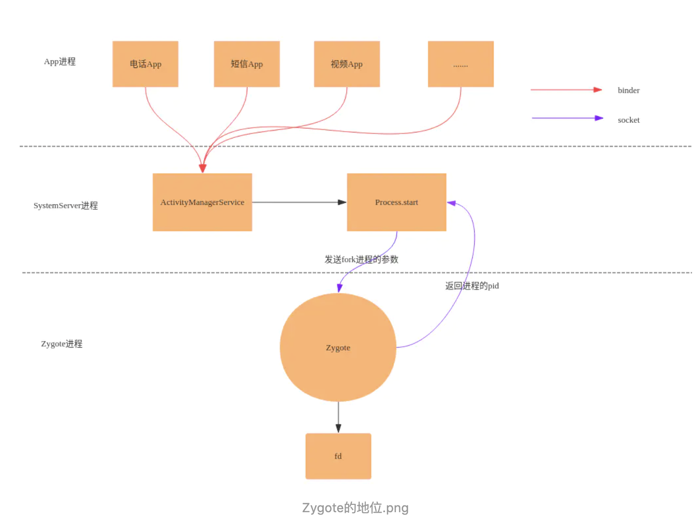

# 注解（Annotation）

## 一、内置注解

在Java中常见的内置注解的如下：

@Override：表示被标记的方法继承了父类同名同参的方法，当检测到父类不存在该方法时将报编译时异常。

@Deprecated：表示被标记的方法已不推荐使用。

@SuppressWarnings()：将提示编译器忽略当前被标记方法中的Warnings

## 二、元注解

​	元注解其实就是注解的规范，也就是来约束定义注解的用法（就像是语法），但是它本身又是一个注解。（就像Android的zygote进程一样，孵化出各种各样的进程[如图]）



- ###  @Retention

  表示被修饰的注解将要保留的阶段。它有三个取值

  - RententionPolicy.SOURCE：将保留至源码阶段。编译时将隐藏
  - RententionPolicy.CLASS：将保留至class文件阶段。但对运行对虚拟机隐藏
  - RententionPolicy.RUNTIME：可保留至运行时。

  一般我们都选择保留至RUNTIME

- ###  @Documented

  表示被修饰的注解将会记入api文档

- ###  @Inherited

  表示被修饰的注解将会被自动继承

- ###  @Target

  表示被修饰的注解将要被作用的位置。它有三个常见取值

  - ElementType.TYPE：可作用于类
  - ElementType.FIELD：可作用于成员变量
  - ElementType.METHOD：可作用于成员方法

## 三、自定义注解

下面我们开始尝试自定义并使用注解：

1、最简单的注解类

```java
/**
 * 定义注解
 */
@Retention(RetentionPolicy.RUNTIME)//注明保留阶段
public @interface Kevin {//自定义注解用 @interfac修饰 
    String name() default "kevin";
}
/**
 * 使用注解修饰
 */
@Kevin(name = "12345")
public class Test {
}
/**
 * 处理注解
 */
public class TestClass {

    public static void showKevin(Class c) {
        Log.d("注解", "c.name() = "+c.getName());
        boolean isExist = c.isAnnotationPresent(Kevin.class);//使用class方法检测是否是注解类

        if (isExist) {
          //通过实体类解析其注解，得到注解实体对象
            Kevin kevin = (Kevin) c.getAnnotation(Kevin.class);
            Log.d("注解", "kevin.name() = "+kevin.name());//得到注解志
        }
    }

    public static void main(String[] args) {
        showKevin(Test.class);//调用
    }
}


    /**
     * {@inheritDoc}
     * @throws NullPointerException {@inheritDoc}
     * @since 1.5
     */
    @Override
    public boolean isAnnotationPresent(Class<? extends Annotation> annotationClass) {
        if (annotationClass == null) {
            throw new NullPointerException("annotationClass == null");
        }

        if (isDeclaredAnnotationPresent(annotationClass)) {
            return true;
        }

        if (annotationClass.isDeclaredAnnotationPresent(Inherited.class)) {
            for (Class<?> sup = getSuperclass(); sup != null; sup = sup.getSuperclass()) {
                if (sup.isDeclaredAnnotationPresent(annotationClass)) {
                    return true;
                }
            }
        }

        return false;
    }

```

2、指定修饰的注解

```java
/**
 * 注解类
 */
@Target(ElementType.TYPE)//注明修饰目标只能是类
@Retention(RetentionPolicy.RUNTIME)//注明保留阶段
public @interface MyClassAnnotation {
        String uriClass();
        String descClass();
}

/**
 * 使用注解修饰
 */
@MyClassAnnotation(descClass = "The Class", uriClass = "com.sgl.annotation")
public class TestAnnotation {
}

/**
 * 理注解
 */
 public static <T> void parseType(Class<T> clazz) {
        try { //通过实体类解析其注解，得到注解实体对象
            MyClassAnnotation myClassAnnotation = clazz.getAnnotation(MyClassAnnotation.class);
            if (myClassAnnotation != null) {
                Log.d("注解", " class uri: " + myClassAnnotation.uriClass());
                Log.d("注解", " class desc: " + myClassAnnotation.descClass());
            }
        } catch (Exception e) {
            e.printStackTrace();
        }

    }

    public static void main(String[] args) {
        parseType(TestAnnotation.class);
    }

```

3、指定修饰的注解(应用到类和方法上)

```java
/**
 * 可以同时应用到类和方法上
 */
@Target({ ElementType.TYPE, ElementType.METHOD })
@Retention(RetentionPolicy.RUNTIME)
public @interface MyClassAndMethodAnnotation {
    // 定义枚举
    public enum EnumType {
        util, entity, service, model
    }

    // 设置默认值
    public EnumType classType() default EnumType.util;

    // 数组
    int[] arr() default { 3, 7, 5 };

    String color() default "blue";
}


/**
 * 使用注解修饰
 */
@MyClassAnnotation(descClass = "The Class", uriClass = "com.sgl.annotation")
@MyClassAndMethodAnnotation(classType = EnumType.entity)
public class TestAnnotation {
}

    public static <T> void parseType(Class<T> clazz) {
        try { //通过实体类解析其注解，得到注解实体对象
            MyClassAndMethodAnnotation myClassAndMethodAnnotation = clazz
                    .getAnnotation(MyClassAndMethodAnnotation.class);
            if (myClassAndMethodAnnotation != null) {
                if (EnumType.util.equals(myClassAndMethodAnnotation.classType())) {
                    Log.d("注解", "this is a util class");
                } else if (EnumType.entity.equals(myClassAndMethodAnnotation.classType())){
                    Log.d("注解", "this is a entity class");
                } else {
                    Log.d("注解", "this is a other class");
                }
            }
            MyClassAnnotation myClassAnnotation = clazz.getAnnotation(MyClassAnnotation.class);
            if (myClassAnnotation != null) {
                Log.d("注解", " class uri: " + myClassAnnotation.uriClass());
                Log.d("注解", " class desc: " + myClassAnnotation.descClass());
            }
        } catch (Exception e) {
            e.printStackTrace();
        }

    }

    public static void main(String[] args) {
        parseType(TestAnnotation.class);
    }

```

4、方法注解与字段注解

```java
/**
 * 方法注解
 */
@Target(ElementType.METHOD)//修饰类型
@Retention(RetentionPolicy.RUNTIME)
public @interface MyMethodAnnotation {
        String uriMethod();
        String descMethod();
}

/**
 * 字段注解
 */
@Target(ElementType.FIELD)//修饰类型
@Retention(RetentionPolicy.RUNTIME)
public @interface MyFieldAnnotation {
        String uriField();
        String descField();
}


@MyClassAnnotation(descClass = "The Class", uriClass = "com.sgl.annotation")
@MyClassAndMethodAnnotation(classType = EnumType.entity)
public class TestAnnotation {
    @MyFieldAnnotation(descField = "The Class Field", uriField = "com.sgl.annotation#id")
    private String id;

    public TestAnnotation() {
    }

    public String getId() {
        return id;
    }

    @MyMethodAnnotation(descMethod = "The Class Method", uriMethod = "com.sgl.annotation##setId")
    public void setId(String id) {
        Log.d("注解", "setId id = "+id);
        this.id = id;
    }

    @MyMethodAnnotation(descMethod = "The Class Method sayHello", uriMethod = "com.sgl.annotation##sayHello")
    public void sayHello(String name) {
        if (name == null || name.equals("")) {
            Log.d("注解", "hello world!");
        } else {
            Log.d("注解", name + "\t:say hello world");
        }
    }
}

 /**
     * 解析方法注解
     *
     * @param clazz
     */
    public static <T> void parseMethod(Class<T> clazz) {
        try {
            T obj = clazz.newInstance();
            for (Method method : clazz.getDeclaredMethods()) {
                MyMethodAnnotation methodAnnotation = method.getAnnotation(MyMethodAnnotation.class);
                if (methodAnnotation != null) {
                         Log.d("注解", "methodAnnotation.uri() = "+methodAnnotation.uriMethod());
                    // 通过反射调用带有此注解的方法
                    method.invoke(obj, methodAnnotation.uriMethod());
                }
                MyClassAndMethodAnnotation myClassAndMethodAnnotation = method
                        .getAnnotation(MyClassAndMethodAnnotation.class);
                if (myClassAndMethodAnnotation != null) {
                    if (EnumType.util.equals(myClassAndMethodAnnotation.classType())) {
                        Log.d("注解", "this is a util method");
                    } else {
                        Log.d("注解", "this is a other method");
                    }
                     Log.d("注解", Arrays.toString(myClassAndMethodAnnotation.arr()));// 打印数组
                     Log.d("注解", myClassAndMethodAnnotation.color());// 输出颜色
                }
                Log.d("注解", "\t\t-----------------------");
            }
        } catch (Exception e) {
            e.printStackTrace();
        }
    }
    public static <T> void parseField(Class<T> clazz) {
        try {
            // 获得字段注解
            Field field = null;// 暴力获取private修饰的成员变量
            field = clazz.getDeclaredField("id");
            MyAnnotation.MyFieldAnnotation myFieldAnnotation = field.getAnnotation(MyAnnotation.MyFieldAnnotation.class);
            Log.d("注解", myFieldAnnotation.descField() + "+" + myFieldAnnotation.uriField());


        } catch (Exception e) {
            e.printStackTrace();
        }
    }


    public static void main(String[] args) {
        parseMethod(TestAnnotation.class);
        parseField(TestAnnotation.class);
    }

```

## 四、注解本质

注解的本质就是给类、方法、字段启了一个别名。


