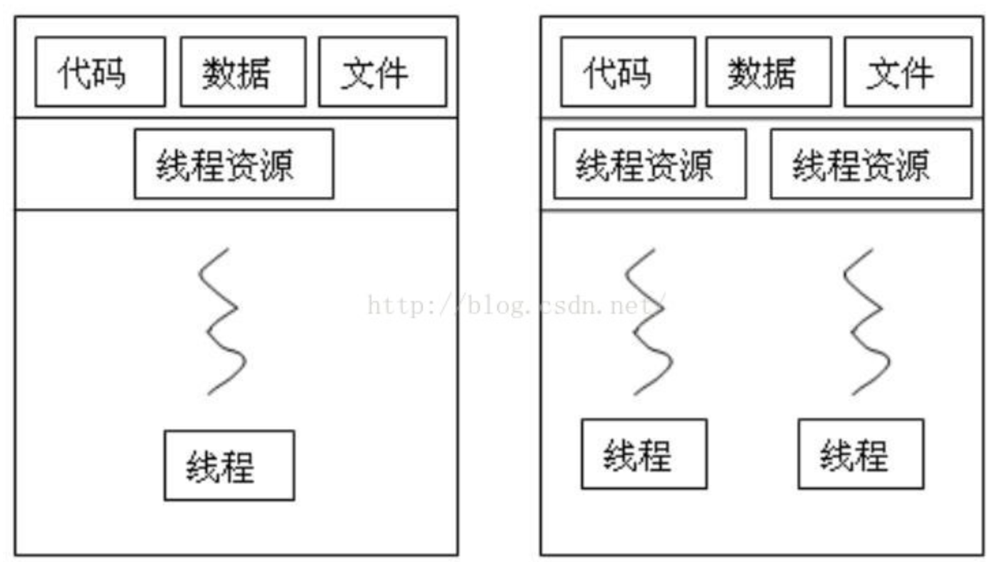

# 线程的正确用法

### 1、什么是进程？什么是线程？

进程：进程是指在操作系统中正在运行的一个应用程序。

线程：线程是程序运行的基本执行单元。

一个APP一般有一个进程，一个进程至少有一个线程。一个主线称也叫UI线程，主要是来执行**UI**操作。



### 2、为什么要使用多线程？

单线程：只有一个队列，所有需要执行任务都在一个线程中排队等待执行，如何前面有任务执行时间较长，后面的任务就一直等待。

多线程：有多个队列，任务在不同的队列中，多个队列可以同时执行任务。

多线程优点：

CPU使用率提升，执行效率提高，执行速度提升。

### 3、内存区域


### 4、什么是线程安全？

线程1在读取主内存区的列表A，同时线程1在删除主内存区域的列表A。那么线程1就可能会读取到已经被线程2删除的列表内容，然后就造成崩溃。这就是线程不安全了。（数据库脏读也是这个原理）

### 5、如何做到线程安全？

```java
private ArrayList<VoicePlayingListener> listeners = new ArrayList<>();

    public void addListener(VoicePlayingListener listener) {
        listeners.add(listener);
    }

    public void removeListener(VoicePlayingListener listener) {
        if (this.listeners != null && listener != null) {
            this.listeners.remove(listener);
        }
    }

    private class MyRunnable implements Runnable {
        @Override
        public void run() {
            try {
                for (float i = 0; i < Integer.MAX_VALUE && listeners.size()>0; ) { // 创建一个死循环，每循环一次i+0.1
                    Thread.sleep(pointerSpeed); // 休眠一下下，可自行调节
                    if (listeners != null){
                        for (int j = 0; j< listeners.size(); j++) {
                            listeners.get(j).onChange();
                        }
                        i += 0.1;
                    }
                }
            }catch (Exception e) {
                e.printStackTrace();
            }
        }
    }
```

如何避免出现线程安全问题？

1、最直接的方式就是给对象加锁，最简单的就是synchronized。

synchronized关键字解决的是执行控制的问题，它会阻止其它线程获取当前对象的监控锁，这样就使得当前对象中被synchronized关键字保护的代码块无法被其它线程访问，也就无法并发执行。

synchronized锁的范围要尽可能的小。

```java
   public void removeListener(VoicePlayingListener listener) { 
            if (this.listeners != null && listener != null) {
            				synchronized (listeners){
                    this.listeners.remove(listener);
                }
            }
   }

private class MyRunnable implements Runnable {

        @Override
        public void run() {
            try {
                for (float i = 0; i < Integer.MAX_VALUE && listeners.size()>0; ) { // 创建一个死循环，每循环一次i+0.1
                    Thread.sleep(pointerSpeed); // 休眠一下下，可自行调节
                    if (listeners != null){
                        synchronized (listeners){
                            for (int j = 0; j< listeners.size(); j++) {
                                listeners.get(j).onChange();
                            }
                            i += 0.1;
                        }
                    }
                }
            }catch (Exception e) {
                e.printStackTrace();
            }
        }
    }
```
2、利用内存可见性，使用volatile修饰。

volatile关键字解决的是内存可见性的问题，会使得所有对volatile变量的读写都会直接刷到主存，即保证了变量的可见性。这样就能满足一些对变量可见性有要求而对读取顺序没有要求的需求。

```java
private volatile ArrayList<VoicePlayingListener> listeners = new ArrayList<>();
```

3、区别

应用范围：volatile仅能使用在变量级别，synchronized则可以使用在变量、方法、和类级别的

线程阻塞：volatile不会造成线程的阻塞；synchronized可能会造成线程的阻塞。

### 6、线程优化防止ANR。

1、ANR类型：

1）. 输入事件(按键和触摸事件)5s内没被处理: Input event dispatching timed out。

2）. BroadcastReceiver的事件(onRecieve方法)在规定时间内没处理完(前台广播为10s，后台广播为60s)。

3）. service 前台20s后台200s未完成启动 Timeout executing service。  

4）. ContentProvider的publish在10s内没进行完：timeout publishing content providers

5）. Waiting to send non-key event because the touched window has not finished 
processing certain input events that were delivered to it over 500.0ms ago.

2、我们出现ANR的原因；

1）数据库增删改查。

2）部分API调用（比如mMediaPlayer.getCurrentPosition()）

3）业务逻辑

```java
protected void onDestroy() {
    LogUtil.d(TAG, " onDestroy");
        @Override
        public void run() {
            LogUtil.d(TAG, " run");
            if (mPlayMode == PlayMode.AUDIO) {
                LogUtil.d(TAG, " run mPlayMode");
                if (!TextUtils.isEmpty(mVideoPlayerBean.getUrl()) && currentProgress != -1) {
                    LogUtil.d(TAG, " run updateVideoInfoPosition");
                    updateVideoInfoPosition();
                    setPlayRecordTrack();
                }
                isPause = true;
                isStop = true;
                //销毁视频
                if (mPlayerManager != null) {
                    LogUtil.d(TAG, " run stopVideo");
                    mPlayerManager.stopVideo(mPlayerView);
                }
                mUIHandler.removeMessages(UI_EVENT_HIDDEN_MESSAGE);
                if (currentPosition > 0) {
                    LogUtil.d(TAG, " run createVideoPlayLog");
                    BrowseLogUtil.createVideoPlayLog(customerId, resourceId, TimeUtils.formatTime(currentPosition));
                }
            }
            LogUtil.d(TAG, " run getInstance");
            VideoStore.getInstance().clear();
            //上传播放记录
            VideoPlayRecordTrackManager.createVideoPlayRecord();
            LogUtil.d(TAG, " run deleteDecodeVideo");
            //删除解码后的视频
            deleteDecodeVideo();
            //注销广播
            unregisterReceiver(decodeReceiver);
            LogUtil.d(TAG, " run removeNetStateListener");
            NetStateManager.getInstance().removeNetStateListener(this.getClass().getName());
            LogUtil.d(TAG, " run removeAll");
            UploadVideoListenerManager.getInstance().removeAll();
            LogUtil.d(TAG, " run gc");
            System.gc();
        }
    super.onDestroy();
}
```

2、如何避免ANR？

不要在主线称非UI操作。

### 7、线程的使用。

1、错误用法。

1）不停的new 线程池。

2）过多的new Thread。

3）直接new Handler.post***。

2、正确使用线程。

1）创建全局单例线程池。根据CPU数来初始化线程池。

```java
ThreadPoolExecutor(int corePoolSize,
                          int maximumPoolSize,
                          long keepAliveTime,
                          TimeUnit unit,
                          BlockingQueue<Runnable> workQueue,
                          ThreadFactory threadFactory,
                          RejectedExecutionHandler handler)
```

2）new Handler.post**可以改为单例一个工具类来执行。比如。

```java

public enum RxHandler {
    INSTANCE;

    /**
     * 当前线程中执行
     * @param runnable
     */
    public void postDelayed(LifecycleOwner owner, Runnable runnable, long delayMillis){
        if (Looper.myLooper() == Looper.getMainLooper()){
            postDelayedUI(owner, runnable, delayMillis);
        }else {
            postDelayedWorker(owner, runnable, delayMillis);
        }
    }

    /**
     * 当前线程中执行
     * @param runnable
     */
    public void postDelayed(Runnable runnable, long delayMillis){
        if (Looper.myLooper() == Looper.getMainLooper()){
            postDelayedUI(runnable, delayMillis);
        }else {
            postDelayedWorker(runnable, delayMillis);
        }
    }

    /**
     * UI线程中执行
     * @param runnable
     */
    public void postDelayedUI(Runnable runnable, long delayMillis){
        Observable.timer(delayMillis, TimeUnit.MILLISECONDS)
                .observeOn(AndroidSchedulers.mainThread())
                .subscribe(new Consumer<Long>() {
                    @Override
                    public void accept(Long aLong) throws Exception {
                        runnable.run();
                    }
                });
    }

    /**
     * UI线程中执行
     * @param runnable
     */
    public void postDelayedUI(LifecycleOwner owner, Runnable runnable, long delayMillis){
        Observable.timer(delayMillis, TimeUnit.MILLISECONDS)
                .observeOn(AndroidSchedulers.mainThread())
                .as(AutoDispose.autoDisposable(AndroidLifecycleScopeProvider.from(owner)))
                .subscribe(new Consumer<Long>() {
                    @Override
                    public void accept(Long aLong) throws Exception {
                        runnable.run();
                    }
                });
    }
    /**
     * Worker线程中执行
     * @param runnable
     */
    public void postDelayedWorker(Runnable runnable, long delayMillis){
        Observable.timer(delayMillis, TimeUnit.MILLISECONDS)
                .observeOn(Schedulers.from(AndroidThreadExecutor.getWorkThreadExecutor()))
                .subscribe(new Consumer<Long>() {
                    @Override
                    public void accept(Long aLong) throws Exception {
                        runnable.run();
                    }
                });
    }

    /**
     * Worker线程中执行
     * @param runnable
     */
    public void postDelayedWorker(LifecycleOwner owner, Runnable runnable, long delayMillis){
        Observable.timer(delayMillis, TimeUnit.MILLISECONDS)
                .observeOn(Schedulers.from(AndroidThreadExecutor.getWorkThreadExecutor()))
                .as(AutoDispose.autoDisposable(AndroidLifecycleScopeProvider.from(owner)))
                .subscribe(new Consumer<Long>() {
                    @Override
                    public void accept(Long aLong) throws Exception {
                        runnable.run();
                    }
                });
    }

    /**
     * 当前线程中执行
     * @param runnable
     */
    public void post( Runnable runnable){
        if (Looper.myLooper() == Looper.getMainLooper()){
            postUI(runnable);
        }else {
            postWorker(runnable);
        }
    }


    /**
     * UI线程中执行
     * @param runnable
     */
    public void postUI( Runnable runnable){
        AndroidThreadExecutor.getInstance().postToMainThread(runnable);
    }
    /**
     * UI线程中执行
     * @param runnable
     */
    public void postUI(LifecycleOwner owner, Runnable runnable){
        Observable.just(1)
                .observeOn(AndroidSchedulers.mainThread())
                .as(AutoDispose.autoDisposable(AndroidLifecycleScopeProvider.from(owner)))
                .subscribe(new Consumer<Integer>() {
                    @Override
                    public void accept(Integer integer) throws Exception {
                        runnable.run();
                    }
                });
    }

    /**
     * 工作线程线程中执行
     * @param runnable
     */
    public void postWorker( Runnable runnable){
        AndroidThreadExecutor.getInstance().executeOnWorkThread(runnable);
    }
    /**
     * 工作线程线程中执行
     * @param runnable
     */
    public void postWorker(LifecycleOwner owner, Runnable runnable){
        Observable.just(1)
                .observeOn(Schedulers.from(AndroidThreadExecutor.getWorkThreadExecutor()))
                .as(AutoDispose.autoDisposable(AndroidLifecycleScopeProvider.from(owner)))
                .subscribe(new Consumer<Integer>() {
                    @Override
                    public void accept(Integer integer) throws Exception {
                        runnable.run();
                    }
                });
    }

    /**
     * 取消runnable
     * @param runnable
     */
    public void removeCallbacks(Runnable runnable){
//        if (Looper.myLooper() == Looper.getMainLooper()){
            removeCallbacksUI(runnable);
//        }else {
//            removeCallbacksWorker(runnable);
//        }
    }

//    private void removeCallbacksWorker(Runnable runnable) {
////        AndroidThreadExecutor.getInstance().removeCallbacksWorker(runnable);
//
//    }

    /**
     * 取消runnable
     * @param runnable
     */
    private void removeCallbacksUI(Runnable runnable) {
        AndroidThreadExecutor.getInstance().removeCallbacksUI(runnable);
    }

}
```